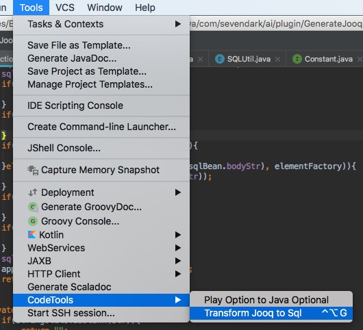

# IDEACodeTools
Intellij Idea plugin

## How to find menu:

## Features:
1. Update `play.libs.F.Option` to `java.util.Optional`
2. Transform Jooq code to SQL script
3. Transform SQL script to Jooq code
 
## Install:
1. <kbd>Settings</kbd> -> <kbd>Plugins</kbd> -> <kbd>Marketplace</kbd> search `CodeTools` to install
2. Open [plugin page](https://plugins.jetbrains.com/plugin/11467-aicoder) to download and install from disk

## How to use Transform Jooq code to SQL script:
1. select jooq code
    
2. press <kbd>ctrl</kbd>+<kbd>alt</kbd>+<kbd>g</kbd>
3. paste SQL anywhere

## How to use Transform SQL script to Jooq code:
1. copy SQL script from anywhere
2. click top menu <kbd>Tools</kbd>-><kbd>CodeTools</kbd>-><kbd>Transform SQL to Jooq</kbd>
3. paste Jooq code anywhere
